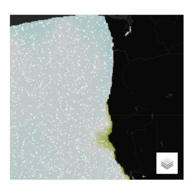
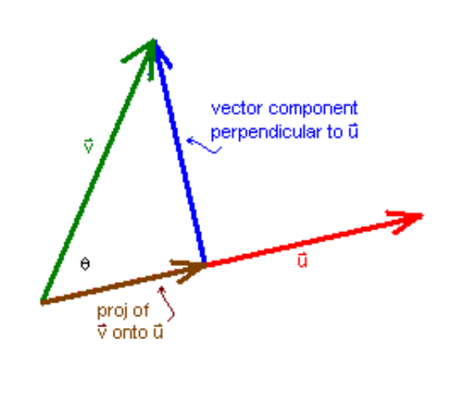

# Leaflet Vector Field Animation

**Raster to Animated Vector** | **Updated: 05/17/2018** | **ASCII Raster Data (*.asc)** | **Contributor:** [Brian Katz](https://github.com/briangkatz)

#### *WORK IN PROGRESS - MATERIAL IS STILL BEING ADDED TO PARTS 2 AND 3*




This module allows you to convert a continuous raster dataset into an animated vector field which visualizes the magnitude and direction of the raster data's pixel values.

[**Demo**](https://briangkatz.github.io/vector-field-animation/)

```
[vector-field-animation]
    ├─assets
    |   └─arag_2050_07_u.asc
    |   └─arag_2050_07_v.asc
    ├─css
    │   └─main.css
    ├─img
    │   └─vector_field.jpg
    │   └─vector_field_animation.jpg
    │   └─vector_field_magnitude.jpg
    │   └─vector_field_direction.jpg
    ├─js
    │   └─main.js
    │   └─leaflet.canvaslayer.field.js
    │index.html
    |LICENSE
    │readme.md
```


## 1\. Set up the workspace

In your IDE (Webstorm), open `index.html` to prepare for editing.


### 1.1 add stylesheets 

``` html
<!-- Stylesheets -->
<link rel="stylesheet" href="https://unpkg.com/leaflet@1.2.0/dist/leaflet.css" />
<link rel="stylesheet" href="css/main.css" />
<link href="https://fonts.googleapis.com/css?family=Open+Sans" rel="stylesheet" />
```


### 1.2 add external libraries

``` html
<!-- External Libraries -->
<script src="https://d3js.org/d3.v4.min.js"></script>
<script src="https://npmcdn.com/leaflet@1.2.0/dist/leaflet.js"></script>
<script src="https://cdnjs.cloudflare.com/ajax/libs/chroma-js/1.3.0/chroma.min.js"></script>
```


### 1.3 create the map div

This module nests the map div within a "map-container" div in order to scale the module down to 400px by 400px with top/bottom margins of 30px and left/right margins of 20px. The margins are set by CSS styling assigned by id="map-container" in the `main.css` file

``` html
<!-- Create the Map div with a surrounding container -->
<div id="map-container">
    <div id="map"></div>
</div>
```


### 1.4 add the two main JavaScript files into the HTML `<body>`

``` html
<body>
    <!-- Create the Map div with a surrounding container -->
    <div id="map-container">
        <div id="map"></div>
    </div>

    <!-- Leaflet CanvasLayer.Field JavaScript -->
    <script src="js/leaflet.canvaslayer.field.js"></script>

    <!-- Main JavaScript -->
    <script src="js/main.js"></script>
</body>
```


## 2\. Data Sources

This module requires raster data in *ASCII Grid format* (*.asc).

Before visualization, each raster you begin with must be processed into **two ASCII files** that represent vector components of your original data. These components are called  **U** and **V**.

- **V** relates to the vector **magnitude**
- **U** relates to the vector **direction**



Source: [Elementary Vector Analysis](https://www.math.hmc.edu/calculus/tutorials/vectoranalysis/vectoranalysis.pdf)

In the figure above, the perpendicular lines represent the **V** (blue) and **U** (red) vector components that the Leaflet.CanvasLayer.Field library uses to dynamically calculate and animate the original data's magnitude (pixel values). Thus, the *green* line labeled **v** represents your starting ASCII raster that you want visualized from two other ASCII rasters, **V** and **U**.


The following sections lay out a workflow to:

1. Start with an ASCII file (**v**)

2. Create a "theta" raster (**&theta;**) using the DEM and Aspect tools in ArcGIS

3. Convert the **&theta;** raster from *aspect* degrees to *math* degrees

4. Calculate **V** and **U** rasters from the **v** and **&theta;** rasters

   ​

### 2.1 Start with an ASCII file (**v**)

In the `assets` folder, you'll see the original raster file used in this example:  `arag_2050_07_v_original.asc`. This data represents projected aragonite saturation state in July 2050, and it is sourced from an ocean acidification (OA) model output by [Hauri and Gruber et al. 2013](https://agupubs.onlinelibrary.wiley.com/doi/epdf/10.1002/grl.50618). Aragonite saturation state is a measure of water corrosivity to bivalve shell-development, a proxy for OA intensity.

### 2.2 Create a "theta" raster (**&theta;**) using DEM and Aspect tools in ArcGIS


### 2.3 Convert the **&theta;** raster from *aspect* degrees to *math* degrees


### 2.4 Calculate **V** and **U** rasters from the **v** and **&theta;** rasters


## 3\. A function-by-function Tutorial

This tutorial walks through the functions of the `main.js` file.

```javascript
// Create the Leaflet map object to place inside the Map div (id="map")
var map = L.map("map");

// Assign a Leaflet Tile Layer Basemap from CartoDB, Mapbox, etc.
var url = 'https://cartodb-basemaps-{s}.global.ssl.fastly.net/dark_nolabels/{z}/{x}/{y}.png';  // replace the URL with a basemap of your choosing
L.tileLayer(url, {
    attribution: 'CartoDB', // attribute the source of your basemap
    maxZoom: 10,  // set the max zoom level
    minZoom: 5  // set the min zoom level
}).addTo(map);  // add the base map to the Leaflet map object

// Bounding Box
var corner1 = L.latLng(48, -130.5),
    corner2 = L.latLng(38, -120.5),
    bounds = L.latLngBounds(corner1, corner2);
map.fitBounds(bounds);  // fit the map bounds to the bounding box specified

// ScalarField derived from a Vectorfield (from IHCantabria Leaflet.CanvasLayer.Field)
d3.text('assets/arag_2050_07_u.asc', function (u) { // add the U data in ASCIIGrid (.asc) format
    d3.text('assets/arag_2050_07_v.asc', function (v) { // add the V data in ASCIIGrid (.asc) format
        var toMetersPerSecond = 0.5; // coefficient multiplied with the U and V data to determine the speed (magnitude) of the animated vector field; larger coefficient result in faster animation speeds (larger magnitudes), smaller coefficient (i.e. decimals) result in slower animation speeds (smaller magnitudes); **This number may need to be modified to normalize the data values as close to their original values as possible. A coefficient very large will overstate the data values, and a small coefficient may understate the data values** Original example was 0.001
        var vf = L.VectorField.fromASCIIGrids(u, v, toMetersPerSecond);  // create the vector field

        // a) First derived field: Magnitude (m/s, or Omega aragonite saturation state)
        var s = vf.getScalarField('magnitude');  // << derived ScalarField
        // custom scale, based on 'earth.nullschool.net' (example:  https://earth.nullschool.net/#current/ocean/surface/currents/overlay=currents/equirectangular=-11.95,29.62,1112)
        var magnitude = L.canvasLayer.scalarField(s, {
            color: chroma.scale(
                ['#DC4404', '#F3BB3B', '#DCDBDB', '#84AEC8', '#5581BA'], [1.0, 1.4, 1.8, 2.2, 2.6]  // set color scale and break points for styling of magnitude layer
            ),
            opacity: 0.5 // 1 will block view of animation if magnitude layer is selected and brought to the front of the map object
        }).addTo(map);  // addTo(map) displays the layer on page-load vs. removing it keeps the layer off the map until the check-box is selected in the Leaflet layer control (see direction layer below for example)

        // b) Second derived field: DirectionFrom (º): (0 to 360º) | N is 0º and E is 90º
        var direction = L.canvasLayer.scalarField(
            vf.getScalarField('directionFrom'), {
                type: 'vector',
                color: '#DCDBDB',  // set color of direction arrows
                vectorSize: 20,  // set the size of the direction arrows
                arrowDirection: 'from'
            });

        // Animation field
        var animation = L.canvasLayer.vectorFieldAnim(vf, {
            id: "canvas",
            paths: 5000,  // set the number of concurrent animations; 1 is one movement animated at a time, 5000 is five thousand movements animated at a time
            fade: 0.97, // 0 animates sharp point movements with no line visible; 1 animates streamlike paths with an always-visible line; anything between 0 and 1 creates a line that fades away after the animation movement
            maxAge: 100,  // how many milliseconds should the animated movement last from start to end points
            velocityScale: 1 / 50,  // a velocityScale of 1 results in a crazy fast animation speed, and a velocityScale of 0 results in no animation whatsoever (no velocity) -- therefore, set velocityScale to a fraction value instead (i.e. 1 / 200). A fraction closer to 1 (i.e. smaller denominator; e.g. 1 / 50) will be faster than a fraction closer to 0 (i.e. larger denominator; e.g. 1 / 200)
            color: 'rgba(255, 255, 255, 0.7)'  // set color and opacity of animation
        }).addTo(map);

        // Leaflet layer control - for toggling between views of animation, magnitude, and direction layers
        L.control.layers({}, {
            "Vector animation": animation,
            "Derived magnitude": magnitude,
            "Derived direction": direction,
        }, {
            position: 'bottomright',  // change to your preference
            collapsed: true  // false always displays check-boxes for the animation, magnitude, and direction layers; true creates a layer-selector icon which hides these check-boxes until hovered over or clicked on
        }).addTo(map);

        // create a popup displaying magnitude values when a pixel is clicked
        magnitude.on('click', function (e) {
            if (e.value !== null) {
                var v = e.value.toFixed(2);
                var html = (`<span class="popupText">magnitude: ${v*2} &Omega; <sub>ar</sub></span>`); // multiply value by 2 to compensate for toMetersPerSecond 0.5
                var popup = L.popup().setLatLng(e.latlng).setContent(html).openOn(map);
            }
        });

        // create a popup displaying direction values when a pixel is clicked
        direction.on('click', function (e) {
            if (e.value !== null) {
                var v = e.value.toFixed(0);
                var html = (`<span class="popupText">direction: ${v}&deg;</span>`);
                var popup = L.popup().setLatLng(e.latlng).setContent(html).openOn(map);
            }
        });
    });
});
```


## 4\. More examples of similar geovisualizations

[Earth - nullschool](https://earth.nullschool.net)


## Acknowledgement

This module is based on the Leaflet.CanvasLayer.Field library from [Victor Velarde](https://github.com/IHCantabria/Leaflet.CanvasLayer.Field).

## References

1. [IHCantabria Leaflet.CanvasLayer.Field (GitHub)](https://github.com/IHCantabria/Leaflet.CanvasLayer.Field)
2. [U and V Components](http://colaweb.gmu.edu/dev/clim301/lectures/wind/wind-uv)
3. [Elementary Vector Analysis](https://www.math.hmc.edu/calculus/tutorials/vectoranalysis/vectoranalysis.pdf)